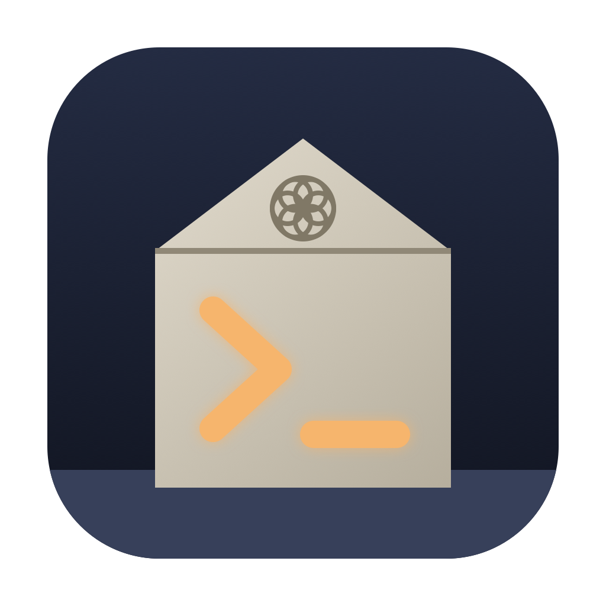

<p align="center"></p>

# Stećak

A fast, lightweight GPU terminal emulator, written in Rust.

The name comes from the *stećci*, the medieval tombstones of Bosnia and Herzegovina (UNESCO World Heritage). They're carved with inscriptions meant to last for centuries. This is a terminal, which is all text, so it seemed fitting.

- **Fast:** the fastest of four terminals on [vtebench](https://github.com/alacritty/vtebench) on an Apple M5: 141 ms, vs Ghostty 191 ms, Terminal.app 2,611 ms and iTerm2 12,383 ms.
- **Light:** ~33 MB per window at rest, and extra tabs and splits cost about 1 MB each.
- GPU rendering (Metal, DX12, Vulkan), programming ligatures, color emoji, tabs and splits.
- Transparency and blur, an iTerm2-style background image, an in-app settings page, and a YAML/JSON config that reloads live.

> **Status: alpha.** It's a daily driver on macOS, and is now being used on Windows. Linux builds in CI but hasn't been used day to day yet.

## Install

**macOS:** download `Stecak-<version>-macos-universal.dmg` from [Releases](https://github.com/alminisl/stecak/releases) and drag Stećak to Applications.
The app isn't notarized yet, so on first launch right-click it and choose **Open**, or run:

```sh
xattr -dr com.apple.quarantine "/Applications/Stećak.app"
```

**From source (macOS, Linux):** needs [Rust](https://rustup.rs).

```sh
curl -fsSL https://raw.githubusercontent.com/alminisl/stecak/main/install.sh | sh
# or from a checkout:
./install.sh
```

On macOS this installs `Stećak.app` plus a `stecak` command. On Linux it installs `~/.local/bin/stecak` and a desktop entry.

**Windows 10/11:** download `stecak-v<version>-windows-x64-setup.exe` (or `-arm64-` for Snapdragon PCs) from [Releases](https://github.com/alminisl/stecak/releases) and run it. It installs for your user only (no admin prompt), adds Stećak to the Start menu, and can put `stecak` on your PATH. A portable `.zip` is there too. The installer isn't code-signed yet, so SmartScreen may warn: choose **More info › Run anyway**. Every push to `main` also builds one: open the CI run in GitHub Actions and download the **stecak-windows-x64** artifact.

**Anywhere with Cargo (incl. Windows):**

```sh
cargo install --git https://github.com/alminisl/stecak
```

**Updates:** Stećak checks GitHub for a newer release at launch, and you can also use **Stećak › Check for Updates…**. On macOS, **Update now** downloads the new DMG, verifies its SHA-256 against the checksum GitHub publishes, swaps the app in place, and offers **Restart**. If the app can't update in place, it opens the release page instead. Turn the launch check off with `check_for_updates: false`.

**Menu bar (macOS):** the Stećak, File, Edit, View, Window and Help menus hold every action, including **Settings…** (⌘,), **Open Config File**, **Sessions…** and **Keyboard Shortcuts** (⌘/).

**Welcome screen:** each launch shows a stećak drawn in text and an inscription formula from the stones. Turn it off in Settings or with `welcome: false`.

Run `stecak` for your login shell, or `stecak -e htop` to run a command instead.

## Why Rust (and not C++)

| | Rust | C++ |
|---|---|---|
| Existing terminal building blocks | `alacritty_terminal` (VT parser + grid + scrollback, used by Zed/Lapce), `portable-pty` (incl. Windows ConPTY), `wgpu`, `winit`, `swash` | libvterm (C, smaller feature set); mostly hand-rolled per platform |
| Cross-platform GPU | `wgpu` → Metal / DX12 / Vulkan / GL from one shader | Write Metal + D3D + GL/Vulkan backends yourself, or pull in bgfx/Skia |
| Windows + macOS + Linux windowing incl. transparency | `winit` (one flag) | Qt (heavy) or GLFW/SDL + per-OS code |
| Memory safety in a parser fed by untrusted bytes | By default | Discipline + fuzzing |
| Build/packaging | `cargo build` everywhere | CMake + vcpkg/conan per OS |
| Prior art | Alacritty, WezTerm, Rio, Warp, Zed's terminal | Windows Terminal, Konsole, (Kitty is C) |

Ghostty is Zig with a C ABI core; its speed comes from architecture (GPU atlas,
dedicated I/O thread, SIMD parsing) rather than language. Rust gives you the same
performance ceiling plus a ready-made ecosystem, so for a solo/small-team terminal it's the
clear pick. C++ only wins if you want Qt widgets or must embed into an existing C++ app.

## Architecture

```
 PTY reader thread (per tab)                     UI thread (winit event loop, idle = 0% CPU)
 ┌──────────────────────────┐   Wakeup event    ┌─────────────────────────────────────────┐
 │ read 64 KB → VT parser →  │ ────────────────▶ │ request_redraw (coalesced per frame)    │
 │ Term grid (under a mutex) │                   │ lock grid → build runs → shape (cached) │
 └──────────────────────────┘                   │ → instanced quads → 1 draw call/frame   │
                                                └─────────────────────────────────────────┘
```

- **Parsing off the UI thread**: output is parsed as it arrives; rendering just snapshots the
  grid, so a flood of output never blocks input or redraws (vsync caps frame count).
- **Rendering**: a 1 MB R8 glyph atlas plus one instanced draw per frame. Box-drawing and
  block characters are drawn as rects so lines join seamlessly.
- **Text**: `swash` shapes runs of same-style cells with OpenType `calt`/`liga`, so
  ligatures work while glyphs stay on the cell grid. Shaped runs are cached by text.
- **Fonts**: memory-mapped, not copied. Fallback fonts (icons, CJK, symbols) are opened only
  the first time a character needs them, and the system font database is dropped after startup.

## Measurements (Apple M5, macOS 27, release build, 100×30 window)

| | Stećak | iTerm2 |
|---|---|---|
| `cat` 34 MB of colored, ligature-heavy text (avg of 3) | **0.38 s**, screen updating live | 4.70 s |
| Memory, idle, 1 pane | **33 MB** | ~730 MB total with your existing sessions; about 40 MB per extra window |
| 4 splits / 4 tabs, idle | 34 MB / 35 MB, so extra panes cost about 1 MB until they fill with scrollback | |
| With a 6016×6016 JPEG background | 32 MB steady (texture sized to the window) | |
| After 1.2 M lines of output | 47 MB (2,000-line scrollback) | |
| Idle CPU | 0.0% | |
| CPU to build a frame while typing (3 splits) | ~32 µs, with 94% of rows replayed from cache | |
| Output in a background tab | 0 frames rendered (all skipped) | |
| Binary | 7.1 MB | ~100 MB app bundle |

Where the 33 MB goes:
- ~20 MB is macOS framework overhead that any AppKit + Metal app pays (window, menus, CoreAnimation, Metal driver).
- ~5 MB is swapchain buffers, which scale with window size.
- ~2 MB is the first block of terminal grid.
- Stećak's own data (atlases, caches) is under 1 MB.

The Metal driver also uses about 70 MB more for roughly a second after launch, then releases it.

Set `STECAK_STATS=1` to log frame statistics.

## Configuration

`~/.config/stecak/config.yaml` (or `.yml` / `.json`; `%APPDATA%\stecak\` on Windows, or set
`STECAK_CONFIG`). It's reloaded live on save. **Cmd+,** (Ctrl+Shift+, elsewhere) creates the
file and opens it. See [`config.example.yaml`](config.example.yaml).

## Shortcuts (Cmd on macOS, Ctrl+Shift on Windows/Linux)

| Key | Action |
|---|---|
| T / W | new tab / close pane (closes the tab with its last pane) |
| D / Shift+D (Ctrl+Shift+E off macOS) | split right / split down |
| ] / [ | next / previous pane |
| Shift+] / Shift+[, Ctrl+Tab, 1–9 | switch tab |
| C / V | copy selection / paste (bracketed-paste aware) |
| F, G / Shift+G | find in scrollback, next / previous match |
| K | clear scrollback |
| = / - / 0 | font size bigger / smaller / reset |
| Shift+A / Shift+S | agent split / session browser |
| I / Shift+E / Shift+L | ask AI for a command / explain last error / send selection to agent (Ctrl+Shift+I / X / L elsewhere) |
| Shift+P | command palette |
| Shift+B | Bosančica mode on/off |
| , | settings page (⚙ in the tab bar too) |
| / | keyboard shortcut legend |

Mouse:
- Drag to select; double-click selects a word, triple-click a line, Shift+click extends.
- Cmd+click (Ctrl+click off macOS) opens a URL.
- In apps that capture the mouse (vim, tmux, htop), hold Shift to select text instead.
- Dropping a file types its path. Dropping an image while settings are open sets the background.

## Background image

```yaml
background_image:
  path: ~/Pictures/wall.jpg
  opacity: 0.55   # below 1, the (blurred) desktop shows through the image
  tint: 0.35      # theme background color laid over the image
  fit: cover      # cover | contain | stretch | center
```

The image is decoded on a worker thread and resized to the window, so a 4K wallpaper costs only window-size GPU memory. JPEGs are decoded directly at 1/2, 1/4 or 1/8 scale.

## Built for AI agents (Claude Code, Codex)

- **Working / waiting tabs:** while `claude` or `codex` is working in a tab, a carved rosette turns and an amber chisel stroke sweeps along the tab. When the agent finishes or needs permission, the tab shows a steady **●**.
- **Alerts:** if you're in another app, you also get a macOS notification and a Dock bounce. Stećak listens to the terminal bell and to OSC 9/777 notifications. To make Claude Code use them, run `claude config set --global preferredNotifChannel terminal_bell` (or `iterm2`, to get the message text).
- **Shift+Enter** inserts a newline in agent prompts.
- **Clickable links:** links that agents print as OSC 8 hyperlinks, plus plain URLs, open with Cmd+click.
- **Agent split:** **Cmd+Shift+A** opens your agent in a split, in the current folder (`agent.command`, default `claude`).
- **Session browser:** **Cmd+Shift+S** lists your saved Claude Code and Codex sessions, newest first, with ● on live ones. Type to search. Enter or a click resumes a session in a new tab, in its folder.
- **No flicker:** agent UIs redraw constantly, and synchronized output (mode 2026) is supported.
- **Ask AI for a command (⌘I):** describe what you want ("find files over 100 MB here") and the command is typed at your prompt for you to check. It's never run for you. This uses `claude -p` (`agent.ask_command`), so there's no API key to set up.
- **Explain last error (⌘⇧E):** the last command, its exit code and its output go to your agent, which explains what went wrong. If no agent is open in the tab, one opens in a split. This needs zsh shell integration (on by default). Without it, the agent gets what's on screen instead.
- **Send selection to agent (⌘⇧L):** pastes the selected text (or, with nothing selected, the last command and its output) into the agent as context, so you can type your question after it.
- **Context bar:** while Claude Code runs in the tab, a bar under the panes fills up as its context window does, colored by what's in it (system prompt, tools, MCP, memory files, skills, messages) with the autocompact buffer marked at the end, plus tokens used, % of the window and % left until auto-compact. Hover it for the full breakdown. The live total comes from the session transcript; the breakdown comes from running Claude Code's own `/context` in that folder in the background (no API call, refreshed every 10 minutes). Turn it off with `agent.context_bar: false` or in Settings.
- **Paste images into agents:** ⌘V with an image (e.g. a screenshot) on the clipboard sends it to Claude Code or Codex.
- **Sessions come back:** when you close the window, each pane's folder is saved, along with the exact Claude Code conversation running in it. At the next launch, every tab and split reopens with `claude --resume <that session>`. Codex panes resume their latest conversation in that folder. When you quit the agent, you're left at a shell.

```yaml
agent:
  command: claude                        # or "codex"
  notifications: true
  ask_command: claude -p --model haiku   # one-shot command for ⌘I; the prompt is appended
  context_bar: true                      # context-window bar under Claude Code panes
restore_session: true    # reopen tabs, splits, folders and agent sessions at launch
                         # (Settings › "Restore sessions at launch"; off also forgets the saved one)
shell_integration: true  # zsh reports each command and its exit status (OSC 133)
editor: ""               # for ⌘-click on file:line; empty = VS Code / Cursor / Zed / default app
                         # e.g. "nvim +{line} {file}" (terminal editors open in a new tab)
```

**Command palette (⌘⇧P):** every action, every theme and every installed monospace font, all in one searchable list.

**Clickable file paths:** ⌘-click `src/main.rs:120:5` in compiler or agent output to open it at that line in your editor.

## Bosančica mode

Press **Cmd+Shift+B** (Ctrl+Shift+B on Linux and Windows), or toggle it in Settings, to draw the terminal in *bosančica*, the medieval Bosnian script.

Fonts like **BoSanko2** map ordinary Latin letters to Bosančica letterforms, so only the rendering changes. What you type, copy and search stays plain text.

The font isn't bundled. **BoSanko2** is the work of designer **Miomirka Mila Melank**, and it's used by the [e-bosanski.ba Bosančica converter](https://www.e-bosanski.ba/konverter-pisama/bosancica/). Get it from its author, install it, or point the config at the file:

```yaml
bosancica:
  enabled: true
  font: BoSanko2          # an installed family name, or a path like ~/Downloads/BoSanko2.ttf
  size: 1.15              # multiplier on top of automatic size matching
  weight: 0.4             # stroke thickening for thin display fonts (0 = none)
```

## Transparency per OS

| OS | Transparency | Blur |
|---|---|---|
| macOS | ✅ verified (Metal, post-multiplied alpha) | ✅ window-server blur (same approach as Ghostty) |
| Windows 10/11 | ✅ DX12 composition swapchain, premultiplied alpha (same approach as Windows Terminal) | Acrylic / blur via `window-vibrancy` |
| Linux Wayland | ✅ via compositor alpha | compositor-dependent (KDE, Hyprland rules) |
| Linux X11 | needs a compositing WM (picom, KWin, Mutter) | compositor rules |

Windows uses DX12 even when Vulkan is available, because Vulkan swapchains there are always opaque. Set `WGPU_BACKEND=vulkan` to override.

## What Stećak builds itself vs. what it reuses

Stećak uses the **`alacritty_terminal` library crate**: the VT/ANSI parser, the grid/scrollback storage, and the selection, regex-search and damage-tracking primitives. That's the same core Zed's built-in terminal uses. It does **not** use or wrap the Alacritty *app*. The following are all Stećak's own code:
- window and renderer (wgpu; Alacritty uses OpenGL)
- font loading and fallback
- shaping and ligatures (Alacritty has no ligatures)
- color emoji
- tabs and splits (Alacritty has neither)
- background image, settings page, search UI, mouse/URL handling
- damage cache, frame skipping and config

## Roadmap

- **Before a public beta:**
  - signed, notarized macOS app
  - Windows and Linux actually run day to day (today they only build in CI)
  - vttest/esctest compatibility pass
  - panic recovery per pane
  - IME tested with real input methods (support is implemented but unverified)
- **For 1.0:**
  - kitty keyboard protocol
  - shell integration (OSC 7, OSC 133, OSC 8 links)
  - multiple windows and session restore
  - configurable key bindings
  - VoiceOver support and auto-update
- **Later:**
  - inline images (kitty graphics, sixel)
  - compressed scrollback (needs its own grid instead of `alacritty_terminal`'s; the main remaining memory lever)

## License

[MIT](LICENSE)
